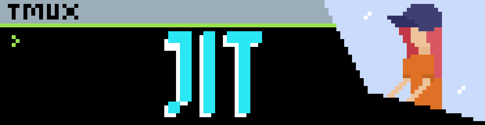
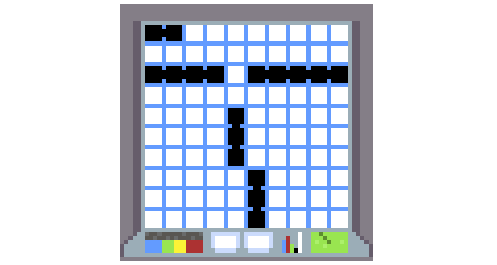
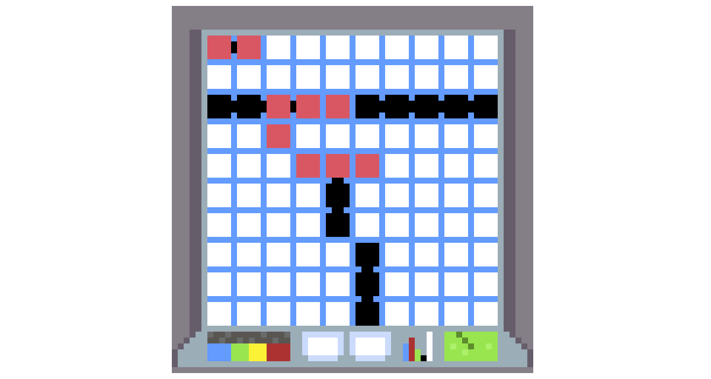

# JIT CUP



<a href="https://discord.gg/UYk2UvPubh"></a>  
<a href="https://jit-platform.vercel.app/"></a>  


JIT or Just In Time is a fun, adventurous coding competition where we tend to compete programs against each other.
So, If you think you can win, take on a challenge.

## Somewhere in Danville

Dr. Doofenshmirtz has had enough of the unbearable heat and decided to freeze all the ocean's water. The reason remains unknown, but fortunately, Agent P has arrived at the scene to prevent this catastrophe.

Doofenshmirtz has deployed 5 underwater ships that will freeze the ocean water. Your mission, Agent P, is to locate all these ships before it's too late. Additionally, to unfreeze the ocean, you'll need to deploy 5 of your own ships in such a way that the evil Dr. Doofenshmirtz won't find them.

Good luck, Agent P! The fate of the ocean rests in your hands.

### Deploy Ships

To begin, deploy 5 of your own ships. These ships come in different sizes and can be placed 
either horizontally or vertically, but not diagonally.

    - Carrier: 5 cells
    - Battleship: 4 cells
    - Cruiser: 3 cells
    - Submarine: 3 cells
    - Destroyer: 2 cells



### Locate Ships

This is a turn-based game. Each turn, you'll need to guess a cell where the opponent's ship might be hiding.
The player who guesses all opponent ship cells in the fewest guesses wins.



## Where's Perry?

Perry will assist you in writing a program that prints a single coordinate during your turn,
indicating where a ship might be located. You can write this program in C, Rust, C++, Java, Python, or JavaScript.

## GUIDELINES TO FOLLOW

To participate you must follow the flow.

1. Make a git repo
2. Have the following folder structure
3. Submit the repo URL to participate

### Folder Structure

```
|──INFO (MANDATORY, should be a file without any extension. i.e no .txt)
|──README.md (optional)
|──main.c (Naming it main is MANDATORY)
|──GRID (MANDATORY, should be a file without any extension, Will contain your ships deploy info)
|──folder1/ (Example, You can have helper things)
|  |──helper.c
```

INFO must contain two things,

    - YOUR NAME 
    - LANGUAGE YOU USED

GRID must contain 100 lines. Since we will have a 10x10 grid<br>
For example, Suppose you had a grid size 3x5. Then the GRID file will read as follow.  

If this is your layout
``` console
- * - * *
- * - - -
- * - - -
```
Then this is your `GRID` file
```md
0
1
0
1
1
0
1
0
0
... and so on.
```
    - 1 signifies an occupied cell
    - 0 signifies an empty cell

You will have to design your grid file using the link that will be provided soon and have that in the repo.

## WHAT SHOULD THE CODE LOOK LIKE

Just write code for a single-turn. You could store your position in a file and then read again in the next turn and make decision.
Your code will take in 2 arguments from the commandline. These args are as follow: <br>
    - ACKNOWLEDGEMENT
    - CORRECT_CELLS_LEFT_COUNT

Your code should print to stdout a specific coordinate in the format "X Y", where both X and Y range from 1 to 10.
Both X and Y start from 1 and go till 10. So for example the output could be "1 5" or "9 3".
<bold>If a bot repeats a co-ordinate twice, It will get disqualifed and the opponent will score 1 point</bold>

ACKNOWLEDGEMENT will tell you about weather in the last round the specified co-ordinate by you were correct or not by saying
either "HIT", "MISS" or in the case of very first round "NONE".

```console
$ ./main ACKNOWLEDGEMENT CORRECT_CELLS_LEFT_COUNT
```

### Tournament Type

This Tournament will be of a single round with each of the player bots. At the end one who has most points wins.

---  
Join us over on the discord server https://discord.gg/rsgg59FR
