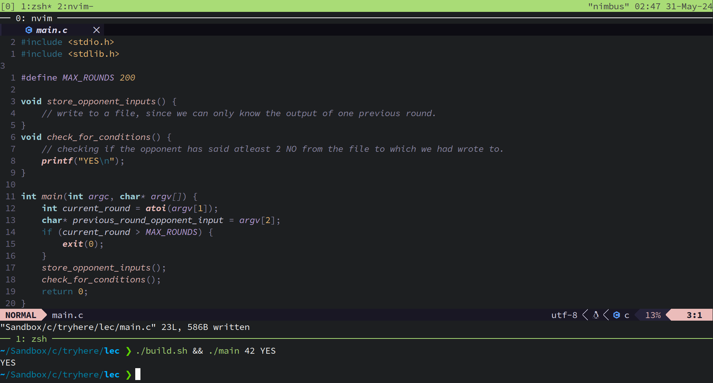

# JIT CUP
<a href="https://discord.gg/UYk2UvPubh"> </a>  
JIT or Just In Time is fun, adventurous coding competition where we tend to compete our programs against each other.

## Somewhere in Bellwood

Ben and Albedo are enjoying their Mr. Smoothy drinks. Once they finish, they are given a choice: they can either give their empty cups to the machine next to them and receive some coins in return, or they can keep the cups. There's a catch: they won't be able to communicate with each other the whole time. The outcome for each depends not only on their own decisions but also on the decisions made by the other.

### Cooperate

If both of them cooperate and give their empty cups, they both receive +2 coins.


If both of them choose not to give the empty cup, neither of them gains any coins.


### Cheat

If one of them cheats (i.e., does not give the empty cup) while the other cooperates (i.e., gives the empty cup), the one who cheats gains +3 coins, and the one who cooperates loses 1 coin.


## It's Hero Time

It is your time to step into the shoes of ben and make those decisions.
Write a program that will print out either "YES" or "NO" to stdout.
You can write this program in the following languages: C, RUST, PYTHON, JS

## GUIDELINES TO FOLLOW

To participate you must follow the flow.

1. Make a git repo
2. Have the following folder structure
3. Submit the repo URL to participate

### Folder Structure

```
|──INFO (MANDATORY)
|──README.md (optional)
|──main.c (Naming it main is MANDATORY)
|──folder1/ (Example, You can have helper things)
|  |──helper.c
```

INFO must contain two things,

YOUR NAME<br>
LANGUAGE YOU USED

## WHAT SHOULD THE CODE LOOK LIKE

There will be 200 rounds played between 2 bots. A single round will be consisted of you getting 2 arguments from the terminal.<br>
These arguments are the count of the current round and the info of what the opponent player had said in the previous round.<br>
In case of the very first round when no one has played any round before the second argument will then say "NONE".<br>

```console
$ ./main CURRENT_ROUND_NUM OPPONENT_PLAYER_PREVIOUS_ROUND_INPUT
```

### Tournament Type

This Tournament will be of a round robin type. Each players bot will compete against all other players bots.
In the end of the tournament (i.e after each bot plays 200 rounds with all other bots) total points scored by each bot will be calculated. one who's bot has scored more points will win.

### Example:

Now you can get as creative you want, Store the info of what the other player had said in a file and read it after maybe 10 rounds
check weather if the opponent has said 4 No's.



Here's an example of a repository you can submit: https://github.com/amodmanjarekar/JIT-demo
